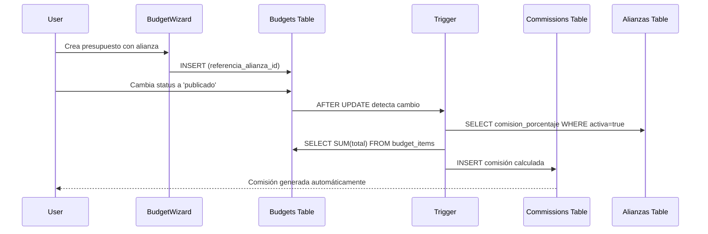

# Fase 5: Integración Bidireccional Alianzas ↔ Comisiones

**Duración:** 2.5 horas  
**Estado:** ✅ Completada al 100%

## Resumen

Implementación de integración bidireccional entre Alianzas y Comisiones, permitiendo ver comisiones generadas por cada alianza y auto-generar comisiones automáticamente al publicar presupuestos referidos.

## Cambios en Base de Datos

### 1. Nueva Columna en Budgets
```sql
ALTER TABLE budgets 
ADD COLUMN referencia_alianza_id UUID REFERENCES alianzas(id) ON DELETE SET NULL;
```

- **Propósito:** Vincular presupuestos con alianzas que los refirieron
- **Índice:** `idx_budgets_referencia_alianza` para performance

### 2. Trigger de Auto-Generación

**Función:** `auto_generate_alliance_commission()`
- **Trigger:** Se ejecuta AFTER UPDATE en budgets
- **Condición:** Solo cuando `status` cambia de NO 'publicado' → 'publicado' Y `referencia_alianza_id IS NOT NULL`

**Lógica:**
1. Valida que la alianza esté activa
2. Obtiene `comision_porcentaje` de la alianza específica
3. Calcula total del presupuesto (suma de `budget_items.total`)
4. Calcula monto de comisión: `total * (porcentaje / 100)`
5. Inserta registro en `commissions` table con status 'calculada'

**Validaciones:**
- Alianza debe estar activa (`activa = true`)
- Presupuesto debe tener items (`total > 0`)
- Si falla, no interrumpe la operación (RAISE NOTICE)

## Componentes Nuevos

### 1. AllianceCommissionsTab.tsx
**Ubicación:** `src/components/alianzas/AllianceCommissionsTab.tsx`

**Props:**
- `allianceId: string` - ID de la alianza
- `allianceName: string` - Nombre de la alianza

**Features:**
- Stats cards agregadas (Total Generado, Pendiente, Pagado, # Comisiones)
- Tabla detallada de todas las comisiones de esa alianza
- Información de cliente/proyecto asociado
- Badges de estado colorizados
- Botón para ver detalles completos
- Empty state cuando no hay comisiones

**Hook personalizado:**
```typescript
useQuery(['alliance-commissions', allianceId])
```
- Fetch comisiones filtradas por `sujeto_id = allianceId`
- Fetch budget details separadamente para cada comisión
- Incluye datos de cliente via joins anidados

## Modificaciones en Páginas Existentes

### 1. Alianzas.tsx
**Cambios:**
- Agregado import de `Tabs, TabsContent, TabsList, TabsTrigger`
- Agregado import de `AllianceCommissionsTab`
- Estado `selectedAllianceId` y `selectedAllianceName`
- Card envuelto en Tabs con 2 tabs:
  - **Lista:** Tabla original de alianzas
  - **Comisiones:** Tab dinámico mostrando `AllianceCommissionsTab`
- Botón `DollarSign` en cada fila para seleccionar alianza y ver comisiones
- Tab "Comisiones" se habilita solo cuando hay alianza seleccionada

### 2. BudgetWizard.tsx
**Cambios:**
- Estado `referenciaAlianzaId`
- Query `alianzas-activas` fetching alianzas activas con `nombre, tipo, comision_porcentaje`
- Selector dropdown "¿Fue referido por alguna alianza?"
  - Opción "Ninguna" por defecto
  - Dropdown con alianzas activas mostrando nombre y porcentaje
  - Helper text explicando auto-generación de comisión
- Campo `referencia_alianza_id` se incluye en INSERT de budgets

## Flujo de Auto-Generación



## Testing

### Caso 1: Ver Comisiones de Alianza
1. Ir a Herramientas → Alianzas
2. Click en ícono DollarSign de cualquier alianza
3. Verificar que tab "Comisiones" se habilita
4. Click en tab "Comisiones"
5. **Esperado:**
   - Stats cards muestran totales agregados
   - Tabla muestra todas las comisiones de esa alianza
   - Badges de estado correctos
   - Información de cliente/proyecto visible

### Caso 2: Auto-Generación al Publicar
1. Ir a Presupuestos → Nuevo Presupuesto
2. Seleccionar proyecto
3. En "¿Fue referido por alianza?" seleccionar una alianza
4. Crear presupuesto y agregar items
5. Publicar presupuesto
6. **Esperado:**
   - Comisión se genera automáticamente
   - Status 'calculada'
   - Monto = total_presupuesto * (comision_porcentaje / 100)
   - Nota: "Comisión generada automáticamente al publicar presupuesto"

### Caso 3: Alianza Inactiva
1. Desactivar una alianza en Herramientas → Alianzas
2. Crear presupuesto referido por esa alianza
3. Publicar presupuesto
4. **Esperado:**
   - NO se genera comisión
   - NOTICE en logs: "No se generó comisión: alianza inactiva o no encontrada"

### Caso 4: Presupuesto sin Items
1. Crear presupuesto referido por alianza
2. Publicar sin agregar items (total = 0)
3. **Esperado:**
   - NO se genera comisión
   - NOTICE en logs: "No se generó comisión: presupuesto sin items o total = 0"

## Beneficios

### Para Gestión de Alianzas
- ✅ Visibilidad completa de rendimiento por alianza
- ✅ Métricas agregadas en tiempo real
- ✅ Drill-down a detalles de cada comisión
- ✅ Transparencia en generación de comisiones

### Para Gestión de Presupuestos
- ✅ Captura fácil de origen de referencia
- ✅ Auto-generación elimina trabajo manual
- ✅ Trazabilidad clara de comisiones
- ✅ Helper text educativo sobre impacto

### Para Colaboradores
- ✅ Workflow simplificado
- ✅ No olvidan marcar alianzas
- ✅ Comisiones correctas automáticamente
- ✅ Menos errores humanos

## Arquitectura Técnica

### Schema de BD
```sql
budgets
  ├── referencia_alianza_id (UUID FK → alianzas)
  └── Trigger: auto_generate_alliance_commission()

commissions
  ├── tipo = 'alianza'
  ├── deal_ref (UUID → budgets.id)
  ├── sujeto_id (UUID → alianzas.id)
  └── status = 'calculada'
```

### Performance Considerations
- **Índice:** `idx_budgets_referencia_alianza` para queries rápidas
- **Lazy Loading:** Tabs carga datos solo cuando se selecciona
- **Caching:** React Query con staleTime de 1 minuto
- **Batch Fetching:** Fetch de budgets en paralelo con Promise.all

## Próximos Pasos

Continuar con:
- **Fase 6:** Sistema de Reglas Inteligentes (3h)
- **Fase 7:** Workflow de Pago y Comprobantes (2h)
- **Fase 8:** Mobile Responsive & Dark Mode (1.5h)

---

**Estado:** ✅ Fase 5 completada al 100%  
**Progreso Total:** 12.0 de 22 horas (54%)
