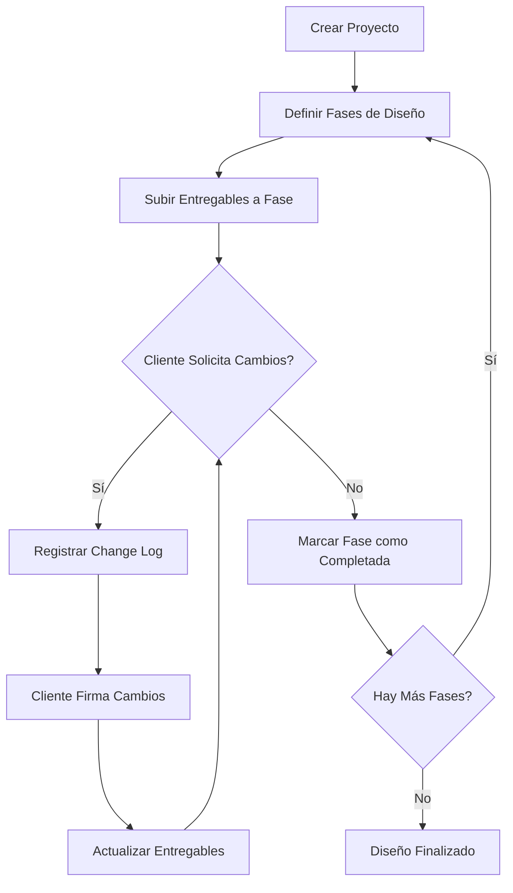

# Módulo de Diseño - Documentación Técnica

## 📋 Tabla de Contenidos

1. [Arquitectura General](#arquitectura-general)
2. [Base de Datos](#base-de-datos)
3. [Flujo de Trabajo](#flujo-de-trabajo)
4. [Hooks y Utilidades](#hooks-y-utilidades)
5. [Componentes UI](#componentes-ui)
6. [Permisos y Seguridad](#permisos-y-seguridad)
7. [Integración con Client App](#integración-con-client-app)
8. [Casos de Uso](#casos-de-uso)

---

## 🏗️ Arquitectura General

El Módulo de Diseño gestiona todo el ciclo de vida del proceso de diseño arquitectónico y ejecutivo de un proyecto, desde la definición de fases hasta la entrega de documentos finales y el registro de cambios solicitados por el cliente.

### Filosofía del Módulo

- **Transparencia Cliente-Equipo**: El cliente puede ver entregables, firmar cambios y hacer seguimiento
- **Trazabilidad Total**: Todo cambio queda registrado con firma digital y responsable
- **Gestión Documental**: Entregables organizados por fase con control de versiones
- **Workflow Flexible**: Fases personalizables según tipo de proyecto

---

## 🗄️ Base de Datos

### Tablas Principales

#### 1. `design_phases`

Almacena las fases del proceso de diseño (ej: Arquitectónico, Ejecutivo, Construcción).

```sql
CREATE TABLE public.design_phases (
  id UUID PRIMARY KEY DEFAULT gen_random_uuid(),
  project_id UUID NOT NULL REFERENCES public.projects(id) ON DELETE CASCADE,
  name TEXT NOT NULL,
  description TEXT,
  start_date DATE,
  end_date DATE,
  status TEXT NOT NULL DEFAULT 'pendiente',
  order_index INTEGER NOT NULL DEFAULT 0,
  created_at TIMESTAMPTZ NOT NULL DEFAULT now(),
  updated_at TIMESTAMPTZ NOT NULL DEFAULT now()
);
```

**Columnas clave:**
- `status`: `pendiente`, `en_proceso`, `completado`
- `order_index`: Permite ordenar fases personalizadas

**Índices:**
- `idx_design_phases_project_id` en `project_id`

**RLS Policies:**
- Admins: acceso total
- Colaboradores: pueden crear/editar/ver fases de proyectos donde colaboran
- Clientes: solo lectura de fases de sus proyectos

---

#### 2. `design_deliverables`

Registra documentos entregables asociados a cada fase (planos, renders, especificaciones).

```sql
CREATE TABLE public.design_deliverables (
  id UUID PRIMARY KEY DEFAULT gen_random_uuid(),
  phase_id UUID NOT NULL REFERENCES public.design_phases(id) ON DELETE CASCADE,
  file_name TEXT NOT NULL,
  file_url TEXT NOT NULL,
  file_type TEXT,
  uploaded_by UUID REFERENCES auth.users(id),
  version INTEGER NOT NULL DEFAULT 1,
  notes TEXT,
  created_at TIMESTAMPTZ NOT NULL DEFAULT now()
);
```

**Columnas clave:**
- `version`: Control de versiones de documentos
- `file_url`: Ruta en Supabase Storage bucket `design-deliverables`
- `file_type`: MIME type (pdf, dwg, png, etc.)

**Índices:**
- `idx_design_deliverables_phase_id` en `phase_id`

**RLS Policies:**
- Admins: acceso total
- Colaboradores: pueden subir/editar entregables en proyectos donde colaboran
- Clientes: solo lectura de entregables de sus proyectos

---

#### 3. `design_change_logs`

Bitácora de cambios solicitados durante el proceso de diseño, con firma digital del cliente.

```sql
CREATE TABLE public.design_change_logs (
  id UUID PRIMARY KEY DEFAULT gen_random_uuid(),
  project_id UUID NOT NULL REFERENCES public.projects(id) ON DELETE CASCADE,
  phase_id UUID REFERENCES public.design_phases(id) ON DELETE SET NULL,
  meeting_date TIMESTAMPTZ NOT NULL DEFAULT now(),
  requested_by TEXT,
  changes_json JSONB NOT NULL DEFAULT '[]',
  notes TEXT,
  signed BOOLEAN NOT NULL DEFAULT false,
  signature_url TEXT,
  signed_at TIMESTAMPTZ,
  created_by UUID REFERENCES auth.users(id),
  created_at TIMESTAMPTZ NOT NULL DEFAULT now(),
  updated_at TIMESTAMPTZ NOT NULL DEFAULT now()
);
```

**Columnas clave:**
- `changes_json`: Array de objetos `{ descripcion: string, prioridad: 'alta'|'media'|'baja' }`
- `signature_url`: Ruta en bucket `firmas` con firma digital del cliente
- `signed`: Indica si el cambio fue firmado y aprobado

**Índices:**
- `idx_design_change_logs_project_id` en `project_id`

**RLS Policies:**
- Admins: acceso total
- Colaboradores: pueden crear/editar logs en proyectos donde colaboran
- Clientes: pueden ver y firmar logs de sus proyectos

---

### Relaciones entre Tablas

```
projects (1) ──→ (N) design_phases
                      │
                      └──→ (N) design_deliverables

projects (1) ──→ (N) design_change_logs
                      │
                      └──→ (1) design_phases [OPTIONAL]
```

---

## 🔄 Flujo de Trabajo

### Flujo Completo del Módulo



### Estados de una Fase

1. **Pendiente**: Fase creada pero sin iniciar
2. **En Proceso**: Equipo trabajando, subiendo entregables
3. **Completado**: Fase terminada y aprobada por el cliente

### Workflow de Cambios

1. **Reunión con Cliente**: Se detectan cambios necesarios
2. **Registro**: Colaborador crea `design_change_log` con lista de cambios
3. **Firma**: Cliente firma digitalmente con canvas o imagen
4. **Implementación**: Equipo actualiza entregables según cambios
5. **Versionado**: Nuevos entregables incrementan `version`

---

## 🎣 Hooks y Utilidades

### Hook Principal: `useDesignPhases`

**Ubicación**: `src/hooks/useDesignPhases.ts`

```typescript
import { useQuery } from "@tanstack/react-query";
import { supabase } from "@/integrations/supabase/client";

export function useDesignPhases(projectId: string | null) {
  return useQuery({
    queryKey: ["design-phases", projectId],
    queryFn: async () => {
      if (!projectId) return null;
      
      const { data, error } = await supabase
        .from("design_phases")
        .select(`
          *,
          design_deliverables(*)
        `)
        .eq("project_id", projectId)
        .order("order_index", { ascending: true });
      
      if (error) throw error;
      return data;
    },
    enabled: !!projectId,
  });
}
```

**Casos de uso:**
- Listar fases de un proyecto
- Obtener entregables por fase
- Dashboard de diseño

---

### Hook: `useDesignChangeLogs`

**Ubicación**: `src/hooks/useDesignChangeLogs.ts`

```typescript
export function useDesignChangeLogs(projectId: string | null) {
  return useQuery({
    queryKey: ["design-change-logs", projectId],
    queryFn: async () => {
      if (!projectId) return null;
      
      const { data, error } = await supabase
        .from("design_change_logs")
        .select(`
          *,
          design_phases(name)
        `)
        .eq("project_id", projectId)
        .order("meeting_date", { ascending: false });
      
      if (error) throw error;
      return data;
    },
    enabled: !!projectId,
  });
}
```

**Casos de uso:**
- Historial de cambios de un proyecto
- Firmas pendientes del cliente
- Auditoría de modificaciones

---

### Mutation: `useUpsertDesignPhase`

```typescript
import { useMutation, useQueryClient } from "@tanstack/react-query";

export function useUpsertDesignPhase() {
  const queryClient = useQueryClient();
  
  return useMutation({
    mutationFn: async (phase: DesignPhase) => {
      const { data, error } = await supabase
        .from("design_phases")
        .upsert(phase)
        .select()
        .single();
      
      if (error) throw error;
      return data;
    },
    onSuccess: (_, variables) => {
      queryClient.invalidateQueries({ 
        queryKey: ["design-phases", variables.project_id] 
      });
      toast.success("Fase guardada exitosamente");
    },
  });
}
```

---

## 🎨 Componentes UI

### 1. `DesignTab.tsx`

**Ruta**: `src/components/design/DesignTab.tsx`

**Propósito**: Vista principal del módulo de diseño en la página del proyecto.

**Características:**
- Lista de fases con estado visual (badges)
- Acordeón expandible por fase
- Botones para subir entregables
- Timeline de cambios

**Props:**
```typescript
interface DesignTabProps {
  projectId: string;
}
```

**Uso:**
```tsx
<DesignTab projectId={project.id} />
```

---

### 2. `ChangeLogDialog.tsx`

**Ruta**: `src/components/design/ChangeLogDialog.tsx`

**Propósito**: Formulario para registrar nuevos cambios solicitados por el cliente.

**Características:**
- Lista dinámica de cambios (agregar/eliminar)
- Selector de prioridad (alta/media/baja)
- Campo de notas generales
- Captura de firma digital (canvas)

**Props:**
```typescript
interface ChangeLogDialogProps {
  projectId: string;
  open: boolean;
  onOpenChange: (open: boolean) => void;
}
```

---

### 3. `DeliverablesUpload.tsx`

**Ruta**: `src/components/design/DeliverablesUpload.tsx`

**Propósito**: Componente de drag-and-drop para subir entregables a una fase.

**Características:**
- Upload a Supabase Storage bucket `design-deliverables`
- Validación de tipos de archivo
- Preview de archivos
- Control de versiones automático

---

## 🔒 Permisos y Seguridad

### RLS (Row Level Security)

Todas las tablas del módulo tienen RLS habilitado con las siguientes políticas:

#### Para `design_phases`:

1. **Admins**: Acceso total (SELECT, INSERT, UPDATE, DELETE)
2. **Colaboradores**: 
   - SELECT: Fases de proyectos donde colaboran
   - INSERT/UPDATE: Fases de proyectos donde tienen permiso de `diseno`
3. **Clientes**:
   - SELECT: Solo fases de sus propios proyectos

#### Para `design_deliverables`:

1. **Admins**: Acceso total
2. **Colaboradores**:
   - SELECT: Entregables de proyectos donde colaboran
   - INSERT: Pueden subir entregables si tienen permiso de `diseno`
3. **Clientes**:
   - SELECT: Solo entregables de sus proyectos

#### Para `design_change_logs`:

1. **Admins**: Acceso total
2. **Colaboradores**:
   - SELECT/INSERT: Logs de proyectos donde colaboran
   - UPDATE: Pueden actualizar logs que crearon
3. **Clientes**:
   - SELECT: Solo logs de sus proyectos
   - UPDATE: Pueden firmar (`signed`, `signature_url`, `signed_at`)

---

### Storage Buckets

#### `design-deliverables`

- **Visibilidad**: Privado
- **Permisos**:
  - Colaboradores: Upload y download
  - Clientes: Solo download
- **Estructura de carpetas**: `{project_id}/{phase_id}/{filename}`

#### `firmas`

- **Visibilidad**: Privado
- **Permisos**:
  - Clientes: Upload (solo firmas propias)
  - Colaboradores: Download
- **Estructura**: `change-logs/{change_log_id}/firma.png`

---

## 📱 Integración con Client App

El módulo de Diseño está completamente integrado en el portal del cliente.

### Vista en Client App

**Componente**: `src/pages/client-app/Design.tsx`

**Características:**
- Visualización de fases con progreso
- Descarga de entregables por fase
- Historial de cambios solicitados
- Interfaz de firma digital para aprobar cambios

### Hooks Específicos del Client App

```typescript
// src/hooks/client-app/useClientDesignPhases.ts
export function useClientDesignPhases(projectId: string | null) {
  return useQuery({
    queryKey: ["client-design-phases", projectId],
    queryFn: async () => {
      // Solo fases visibles para el cliente
      const { data, error } = await supabase
        .from("design_phases")
        .select(`
          id,
          name,
          description,
          status,
          start_date,
          end_date,
          design_deliverables(id, file_name, file_url, file_type, version, created_at)
        `)
        .eq("project_id", projectId)
        .order("order_index");
      
      if (error) throw error;
      return data;
    },
    enabled: !!projectId,
  });
}
```

---

## 📖 Casos de Uso

### Caso 1: Crear Fases de Diseño para Nuevo Proyecto

**Actor**: Colaborador (Arquitecto/PM)

**Flujo:**
1. Navegar a proyecto → Tab "Diseño"
2. Click en "Agregar Fase"
3. Completar formulario:
   - Nombre: "Arquitectónico"
   - Descripción: "Planos arquitectónicos preliminares"
   - Fechas estimadas
4. Guardar
5. Repetir para fases: "Ejecutivo", "Documentos de Obra"

**Resultado**: Proyecto tiene estructura de fases definida.

---

### Caso 2: Subir Entregables a una Fase

**Actor**: Colaborador (Arquitecto)

**Flujo:**
1. Expandir fase "Arquitectónico"
2. Click en "Subir Entregables"
3. Arrastrar archivos:
   - `Planta_Baja_v1.pdf`
   - `Fachada_Principal_v1.dwg`
   - `Render_Exterior_v1.png`
4. Confirmar upload

**Resultado**: Entregables disponibles para descarga del cliente.

---

### Caso 3: Cliente Solicita Cambios y Firma

**Actor**: Colaborador registra, Cliente firma

**Flujo Colaborador:**
1. Después de reunión, navegar a "Diseño" → "Historial de Cambios"
2. Click "Registrar Cambio"
3. Completar:
   - Fecha de reunión
   - Cambios:
     - "Ampliar ventana cocina" (Prioridad: Alta)
     - "Cambiar color fachada a gris" (Prioridad: Media)
   - Notas: "Discutido en visita presencial"
4. Guardar

**Flujo Cliente:**
1. Ver notificación en portal
2. Ir a "Diseño" → "Cambios Pendientes"
3. Revisar lista de cambios
4. Firmar digitalmente con canvas
5. Confirmar

**Resultado**: Cambio firmado, equipo puede proceder con actualización.

---

### Caso 4: Actualizar Entregable con Nueva Versión

**Actor**: Colaborador (después de implementar cambios)

**Flujo:**
1. Expandir fase "Arquitectónico"
2. Localizar entregable `Planta_Baja_v1.pdf`
3. Click "Subir Nueva Versión"
4. Cargar `Planta_Baja_v2.pdf`
5. Agregar notas: "Ventana cocina ampliada según Change Log #12"

**Resultado**: 
- `version` incrementa a 2
- Cliente ve última versión automáticamente
- Historial de versiones preservado

---

## 🔧 Configuración y Mantenimiento

### Variables de Entorno

No requiere variables adicionales. Usa configuración estándar de Supabase.

### Migraciones Importantes

- `20240115_create_design_tables.sql`: Creación de tablas base
- `20240116_add_design_rls_policies.sql`: Configuración de seguridad
- `20240120_create_design_storage_buckets.sql`: Buckets de storage

### Triggers Activos

```sql
-- Auto-actualizar updated_at
CREATE TRIGGER update_design_phases_updated_at
  BEFORE UPDATE ON public.design_phases
  FOR EACH ROW
  EXECUTE FUNCTION public.update_updated_at_column();
```

---

## 🚀 Roadmap y Mejoras Futuras

### Mejoras Planificadas

1. **Notificaciones en Tiempo Real**: 
   - Usar Supabase Realtime para alertar al cliente cuando se suben nuevos entregables

2. **Comentarios en Entregables**:
   - Sistema de anotaciones sobre PDFs/imágenes directamente en la interfaz

3. **Aprobación por Fase**:
   - Workflow formal donde el cliente debe aprobar cada fase antes de avanzar

4. **Integración con Presupuesto**:
   - Cambios que impacten costo deben reflejarse automáticamente en presupuesto

5. **Templates de Fases**:
   - Plantillas predefinidas según tipo de proyecto (casa, departamento, local)

---

## 📞 Soporte

Para dudas sobre este módulo, contactar a:
- **Equipo de Desarrollo**: dev@dovita.com
- **Documentación General**: Ver `README.md` del proyecto

---

## 📄 Licencia y Créditos

Parte de **Dovita Core** - Sistema ERP para constructoras.

© 2024 Dovita Homes. Todos los derechos reservados.
